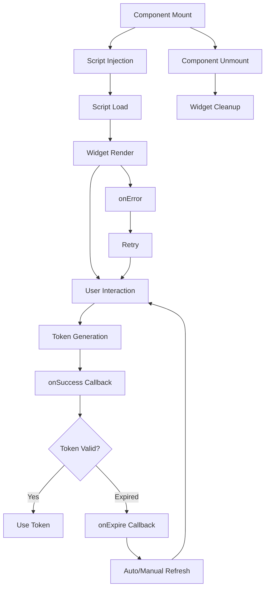

The React Turnstile widget follows a predictable lifecycle from initialization through rendering, verification, and cleanup. Understanding this lifecycle helps you integrate Turnstile effectively in your React applications.

## Lifecycle Overview

The widget lifecycle consists of several phases:



## Phase 1: Mounting & Script Injection

When the Turnstile component mounts, it begins by ensuring the Cloudflare Turnstile script is loaded.

### Script Loading State Machine

The library maintains a global script loading state to prevent duplicate script injections:

<CodeGroup>
```tsx State Management (lib.tsx:22-46)
let turnstileState: 'unloaded' | 'loading' | 'ready' = 'unloaded'

const ensureTurnstile = (onLoadCallbackName = DEFAULT_ONLOAD_NAME) => {
  if (turnstileState === 'unloaded') {
    turnstileState = 'loading'
    window[onLoadCallbackName] = () => {
      turnstileLoad.resolve()
      turnstileState = 'ready'
      delete window[onLoadCallbackName]
    }
  }
  return turnstileLoadPromise
}
```

```tsx Script Injection (lib.tsx:199-213)
useEffect(
  function inject() {
    if (injectScript && !turnstileLoaded) {
      ensureTurnstile(onLoadCallbackName)
      injectTurnstileScript({
        onLoadCallbackName,
        scriptOptions: {
          ...scriptOptions,
          id: scriptId
        }
      })
    }
  },
  [injectScript, turnstileLoaded, scriptOptions, scriptId, onLoadCallbackName]
)
```
</CodeGroup>

### Key Points

- Script injection happens **once per page load**, not per component instance
- Multiple Turnstile widgets on the same page share the same script
- The script state is tracked globally via `turnstileState`
- `injectScript={false}` bypasses automatic injection for manual control

<Note>
If you have multiple Turnstile widgets on the same page, only the first one to mount will inject the script. All others will wait for the shared script to load.
</Note>

## Phase 2: Widget Rendering

Once the script is loaded, the widget is rendered into the DOM.

### Render Effect

<CodeGroup>
```tsx Widget Render (lib.tsx:226-250)
useEffect(
  function renderWidget() {
    if (!containerRef.current) return
    if (!turnstileLoaded) return
    let cancelled = false

    const render = async () => {
      if (cancelled || !containerRef.current) return
      const id = window.turnstile!.render(containerRef.current, renderConfig)
      widgetId.current = id
      if (widgetId.current) onWidgetLoad?.(widgetId.current)
    }

    render()

    return () => {
      cancelled = true
      if (widgetId.current) {
        window.turnstile!.remove(widgetId.current)
        widgetSolved.current = false
      }
    }
  },
  [containerId, turnstileLoaded, renderConfig]
)
```
</CodeGroup>

### Render Dependencies

The widget re-renders when:

- `containerId` changes
- `turnstileLoaded` becomes true
- `renderConfig` changes (includes most `options` and callbacks if `rerenderOnCallbackChange={true}`)

<Warning>
**Important:** Re-rendering the widget causes the previous widget to be removed and a new one to be created. This resets any in-progress challenges.
</Warning>

### onWidgetLoad Callback

The `onWidgetLoad` callback fires immediately after successful render:

```tsx
<Turnstile
  siteKey="your-site-key"
  onWidgetLoad={(widgetId) => {
    console.log('Widget rendered with ID:', widgetId)
    // Widget is now visible and interactive
  }}
/>
```

## Phase 3: Challenge Flow

After rendering, the widget enters the challenge phase.

### Challenge Sequence

<Steps>
  <Step title="Initial State">
    Widget displays in its initial state (checkbox for interactive mode)
  </Step>
  
  <Step title="User Interaction (if needed)">
    If an interactive challenge is required:
    - `onBeforeInteractive()` is called
    - User completes the challenge
    - `onAfterInteractive()` is called
  </Step>
  
  <Step title="Token Generation">
    Cloudflare generates a verification token
  </Step>
  
  <Step title="Success Callback">
    `onSuccess(token)` is called with the token
  </Step>
</Steps>

### Callback Execution Order

```tsx
<Turnstile
  siteKey="your-site-key"
  onWidgetLoad={(widgetId) => {
    console.log('1. Widget loaded:', widgetId)
  }}
  onBeforeInteractive={() => {
    console.log('2. Before interactive challenge')
  }}
  onAfterInteractive={() => {
    console.log('3. After interactive challenge')
  }}
  onSuccess={(token) => {
    console.log('4. Success! Token:', token)
    // Submit to your backend
  }}
/>
```

<Note>
`onBeforeInteractive` and `onAfterInteractive` **only fire if an interactive challenge is required**. Many challenges complete without user interaction.
</Note>

## Phase 4: Token Lifecycle

Tokens have a limited lifetime and may expire or encounter errors.

### Token States

<AccordionGroup>
  <Accordion title="Valid Token">
    After `onSuccess`, the token is valid for a limited time (typically 5 minutes).
    
    ```tsx
    const turnstileRef = useRef<TurnstileInstance>(null)
    
    // Check if token is expired
    const isExpired = turnstileRef.current?.isExpired()
    
    // Get current token
    const token = turnstileRef.current?.getResponse()
    ```
  </Accordion>
  
  <Accordion title="Expired Token">
    When a token expires, `onExpire` is called:
    
    ```tsx
    <Turnstile
      siteKey="your-site-key"
      onExpire={(token) => {
        console.log('Token expired:', token)
        // Widget will auto-refresh based on refreshExpired option
      }}
      options={{
        refreshExpired: 'auto' // or 'manual' or 'never'
      }}
    />
    ```
  </Accordion>
  
  <Accordion title="Error State">
    If verification fails or a network error occurs:
    
    ```tsx
    <Turnstile
      siteKey="your-site-key"
      onError={(error) => {
        console.error('Error code:', error)
        // Handle error based on code
        // See: https://developers.cloudflare.com/turnstile/troubleshooting/client-side-errors/
      }}
      options={{
        retry: 'auto' // Allow user to retry
      }}
    />
    ```
  </Accordion>
  
  <Accordion title="Timeout">
    If the widget times out:
    
    ```tsx
    <Turnstile
      siteKey="your-site-key"
      onTimeout={() => {
        console.warn('Widget timed out')
        // Widget will auto-refresh based on refreshTimeout option
      }}
      options={{
        refreshTimeout: 'auto'
      }}
    />
    ```
  </Accordion>
</AccordionGroup>

## Phase 5: Cleanup

When the component unmounts, the widget is automatically cleaned up.

### Automatic Cleanup

The render effect's cleanup function handles removal:

```tsx lib.tsx:241-247
return () => {
  cancelled = true
  if (widgetId.current) {
    window.turnstile!.remove(widgetId.current)
    widgetSolved.current = false
  }
}
```

This ensures:
- The widget is removed from the DOM
- Event listeners are cleaned up
- No memory leaks occur

### Manual Cleanup

You can also manually remove a widget:

```tsx
const turnstileRef = useRef<TurnstileInstance>(null)

// Remove widget programmatically
turnstileRef.current?.remove()
```

## Lifecycle with useEffect

Here's a complete example showing lifecycle integration:

```tsx
import { useRef, useEffect, useState } from 'react'
import Turnstile, { TurnstileInstance } from '@marsidev/react-turnstile'

function MyForm() {
  const turnstileRef = useRef<TurnstileInstance>(null)
  const [token, setToken] = useState<string | null>(null)
  const [status, setStatus] = useState<'idle' | 'loading' | 'verified' | 'error'>('idle')

  useEffect(() => {
    console.log('Status changed:', status)
    
    // Cleanup on unmount
    return () => {
      console.log('Component unmounting, widget will auto-cleanup')
    }
  }, [status])

  return (
    <form>
      <Turnstile
        ref={turnstileRef}
        siteKey="your-site-key"
        onWidgetLoad={(widgetId) => {
          console.log('[Lifecycle] Widget loaded:', widgetId)
          setStatus('loading')
        }}
        onBeforeInteractive={() => {
          console.log('[Lifecycle] Before interactive challenge')
        }}
        onAfterInteractive={() => {
          console.log('[Lifecycle] After interactive challenge')
        }}
        onSuccess={(token) => {
          console.log('[Lifecycle] Success! Token:', token)
          setToken(token)
          setStatus('verified')
        }}
        onError={(error) => {
          console.error('[Lifecycle] Error:', error)
          setStatus('error')
        }}
        onExpire={(token) => {
          console.log('[Lifecycle] Token expired:', token)
          setToken(null)
          setStatus('idle')
        }}
      />
      
      <button 
        type="submit" 
        disabled={status !== 'verified'}
      >
        Submit
      </button>
    </form>
  )
}
```

## Callback Stability

By default, callbacks are **stable** and don't cause re-renders:

<CodeGroup>
```tsx Stable Callbacks (Default)
// Callbacks are stored in refs and don't trigger re-renders
const callbacksRef = useRef({
  onSuccess,
  onError,
  onExpire,
  // ... other callbacks
})

// Updated on every render without causing widget re-render
useEffect(() => {
  if (!rerenderOnCallbackChange) {
    callbacksRef.current = {
      onSuccess,
      onError,
      // ...
    }
  }
})
```

```tsx Dynamic Callbacks (Opt-in)
// With rerenderOnCallbackChange={true}
// Callbacks in dependency array cause re-renders
<Turnstile
  siteKey="your-site-key"
  rerenderOnCallbackChange={true}
  onSuccess={useCallback((token) => {
    // This callback change will trigger widget re-render
  }, [/* deps */])}
/>
```
</CodeGroup>

<Warning>
**Performance:** Only use `rerenderOnCallbackChange={true}` when you need the widget to re-render based on callback changes. Always wrap callbacks in `useCallback` to prevent unnecessary re-renders.
</Warning>

## Execution Modes

### Automatic Execution (Default)

```tsx
<Turnstile
  siteKey="your-site-key"
  options={{ execution: 'render' }} // Default
  onSuccess={(token) => {
    // Token generated automatically
  }}
/>
```

Lifecycle: **Mount → Render → Auto-generate token → Success**

### Manual Execution

```tsx
const turnstileRef = useRef<TurnstileInstance>(null)

<Turnstile
  ref={turnstileRef}
  siteKey="your-site-key"
  options={{ execution: 'execute' }}
  onSuccess={(token) => {
    // Token generated only after execute() call
  }}
/>

// Later...
const handleSubmit = async () => {
  turnstileRef.current?.execute()
}
```

Lifecycle: **Mount → Render (invisible) → Wait → execute() → Generate token → Success**

## Best Practices

<CardGroup cols={2}>
  <Card title="Handle All States" icon="check">
    Implement `onSuccess`, `onError`, `onExpire`, and `onTimeout` for robust error handling
  </Card>
  
  <Card title="Don't Force Re-renders" icon="xmark">
    Avoid changing `renderConfig` dependencies unnecessarily as it re-creates the widget
  </Card>
  
  <Card title="Use Refs for Actions" icon="check">
    Use `useRef<TurnstileInstance>` for programmatic control (reset, execute, etc.)
  </Card>
  
  <Card title="Stable Callbacks" icon="check">
    Keep default `rerenderOnCallbackChange={false}` for better performance
  </Card>
</CardGroup>

## Next Steps

<CardGroup cols={2}>
  <Card title="Component Props" icon="sliders" href="/core-concepts/component-props">
    Explore all available component props
  </Card>
  
  <Card title="Script Injection" icon="code" href="/core-concepts/script-injection">
    Learn about script loading and CSP
  </Card>
  
  <Card title="Turnstile Instance API" icon="terminal" href="/api/turnstile-instance">
    Use ref methods for programmatic control
  </Card>
  
  <Card title="Troubleshooting" icon="triangle-exclamation" href="/advanced/troubleshooting">
    Handle errors and edge cases
  </Card>
</CardGroup>
